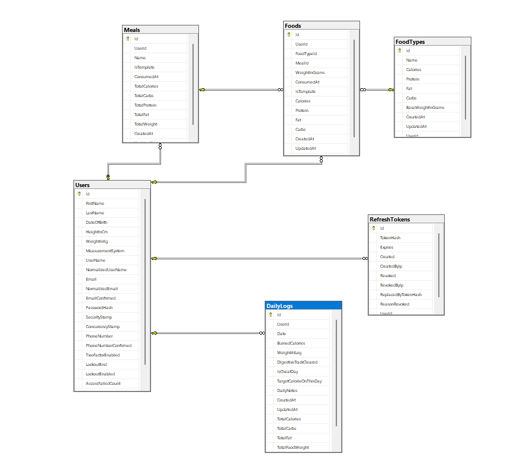

# Calinout API  


A RESTful API for a calorie and nutrition tracking app, 
> built with ASP.NET Core, SQL server and deployed on Azure(only for testing)."

[Live API](https://api-calinout-isl-hfgnhvhqazfjfcfd.francecentral-01.azurewebsites.net/swagger/index.html) 
• [Flutter Repo](https://github.com/predaxmh/calinout-flutter) 

- Database diagram:
<p float="left">
  
</p>

The API is structured in three layers:

**Data Layer** — Entity Framework Core with ASP.NET Identity. 
Handles all database access, migrations, and entity definitions.

**Service Layer** — Business logic and validation. Each service 
implements an interface for testability and uses a `Result<T>` 
pattern to return success or failure without throwing exceptions 
for expected errors. Unhandled exceptions bubble up to the global 
exception handler.

**Controller Layer** — Thin HTTP layer. Controllers extract the 
user ID from JWT claims, delegate to services, and map `Result<T>` 
to the appropriate HTTP response.


```
???????????????????????????????????????
?         Controllers (API)            ?
?  HTTP, routing, JWT claim extraction ?
???????????????????????????????????????
?
???????????????????????????????????????
?           Service Layer              ?
?  Business logic, validation,         ?
?  Result<T> pattern                   ?
???????????????????????????????????????
?
???????????????????????????????????????
?           Data Layer                 ?
?  EF Core, Identity, SQL Server       ?
???????????????????????????????????????
```


## Tech Stack

- ASP.NET Core 9 
- Entity Framework Core 
- Database | SQL Server 
- Auth | ASP.NET Identity + JWT Bearer |
- Mapping | Mapster |
- Testing | xUnit, integration tests, load tests |
- Deployment | Azure App Service (Free Tier) |


## Known Limitations & Reflections

- **Weight tracking** — I stored weight inside the daily log which 
  works but I have now two source of truth(in the user entity). A dedicated weight history table would be 
  better, I found out when I tried to calculate the Basal Metabolic Rate (BMR))

- **Duplicate query logic** — `GetUserFoodsAsync` and 
  `GetUserFoodsByDateRangeAsync` one is with pagination, and the other returns all data. Pagination is a must for mobile dev
  
- **Configuration:** Environment setups and structured logging are default.

- **Testing:** While I understand why we test and how it works, I only implemented tests for specific parts of the project. I used AI to generate tests because the principles are the same across the board.

- **The Goal:** My main objective was to build something end-to-end, over spending weeks reading documentation,to ensure I could deliver a functional full-stack project.

## Getting Started

### Prerequisites
- .NET 9 SDK
- SQL Server (local or Azure)

### Setup
**1. Clone the repository:**
```bash
git clone https://github.com/predaxmh/calinout-api.git
cd calinout-api
```
 
**2. Configure `appsettings.json`:**
 ```
{
  "ConnectionStrings": {
    "DefaultConnection": "Server=.;Database=CalinoutDb;Trusted_Connection=True;TrustServerCertificate=True;"
  },
  "JwtSettings": {
    "Key": "YOUR_SECRET_KEY_MIN_32_CHARACTERS_LONG",
    "Issuer": "CalinoutAPI",
    "Audience": "CalinoutApp",
    "DurationInMinutes": 15,
    "RefreshTokenDurationInDays": 7
  },

  "Logging": {
    "LogLevel": {
      "Default": "Information",
      "Microsoft.AspNetCore": "Warning"
    }
  },
  "AllowedHosts": "*"
}
```
**3. Apply migrations and run:**
```bash
dotnet ef database update
dotnet run
```

---

## API Endpoints (back-end README only)

 "Full API documentation available via Swagger at /swagger"

 The API uses JWT Bearer authentication. To test authenticated 
endpoints in Swagger, register a user, log in to receive a token, 
then use the **Authorize** button.


